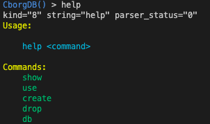
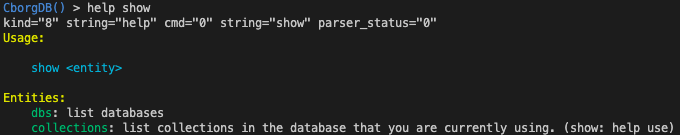
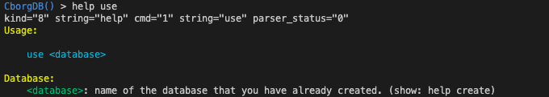
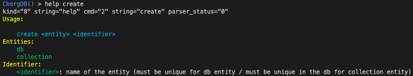
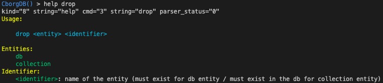
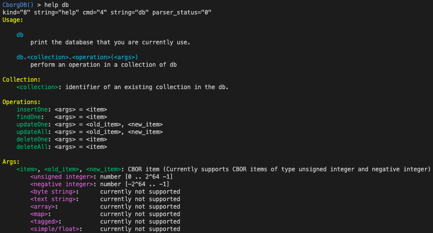

# cborg

<p align="center">
  
</p>

---


CborgDB is 🚧 still under development 🚧 and will be a database management system.
The database will be developed in C language and the project is open source on 🐙 GitHub.

The purpose of CborgDB is to learn how existing database management systems work under the hood and maybe be able to do something different.

## ⚙️ Build

```console
abenhlal@cborgdb:~$ git clone https://github.com/cborgdb/cborg.git
abenhlal@cborgdb:~$ cd cborg
abenhlal@cborgdb:~/cborg$ mkdir build
abenhlal@cborgdb:~/cborg$ cd build
abenhlal@cborgdb:~/cborg/build$ cmake ..
abenhlal@cborgdb:~/cborg/build$ make
```

## 🏡 Install

```console
abenhlal@cborgdb:~/cborg/build$ make install
```

## ✨ Usage

1) Version
```console
abenhlal@cborgdb:~/cborg/build$ ./cborg --version
CborgDB v0.2.0

Maintained by Adil Benhlal <a.benhlal@cborgdb.com>
```

2) Help

- long option
```console
abenhlal@cborgdb:~/cborg/build$ ./cborg --help
Usage:
    ./cborg [options]

Options:
    -h, --help    Display this help
    --version     Print the version of CborgDB
```

- short option
```console
abenhlal@cborgdb:~/cborg/build$ ./cborg -h
Usage:
    ./cborg [options]

Options:
    -h, --help    Display this help
    --version     Print the version of CborgDB
```

2) Run Cborg
```console
abenhlal@cborgdb:~/cborg/build$ ./cborg
CborgDB is running on port 30000.
```

3) In another terminal
```console
abenhlal@cborgdb:~/cborg/build$ ./cborg-cli
CborgDB() > create db toto
kind="2" string="create" entity_type="4" string="db" name="20" string="toto" parser_status="0"

Database created.

CborgDB() > show dbs
kind="0" string="show" entity_type="5" string="dbs" parser_status="0"

toto

CborgDB() > use toto      
kind="1" string="use" db_name="20" string="toto" parser_status="0"
CborgDB(toto) > create collection titi
kind="2" string="create" entity_type="6" string="collection" name="20" string="titi" parser_status="0"

Collection created.

CborgDB(toto) > show collections
kind="0" string="show" entity_type="7" string="collections" parser_status="0"

titi

CborgDB(toto) > db.titi.insertOne(150)
kind="4" string="db" is_an_operation="1" coll_name="20" string="titi" operation="10" string="insertOne" arg1="22" string="150" arg1_is_positive="1" arg2="0" string="" arg2_is_positive="0" parser_status="0"

Item inserted.

CborgDB(toto) > db.titi.findOne(60)
kind="4" string="db" is_an_operation="1" coll_name="20" string="titi" operation="11" string="findOne" arg1="22" string="60" arg1_is_positive="1" arg2="0" string="" arg2_is_positive="0" parser_status="0"

Item not found.

CborgDB(toto) > db.titi.findOne(150)
kind="4" string="db" is_an_operation="1" coll_name="20" string="titi" operation="11" string="findOne" arg1="22" string="150" arg1_is_positive="1" arg2="0" string="" arg2_is_positive="0" parser_status="0"

Item found.

CborgDB(toto) > exit
kind="9" string="exit" parser_status="0"
```

## Help cmd

### help



### help show



### help use



### help create



### help drop



### help db



## 🚪🚶 Uninstall

```console
abenhlal@cborgdb:~/cborg/build$ make uninstall
```

## ✍️ Author

Made with ❤️ by Adil Benhlal
